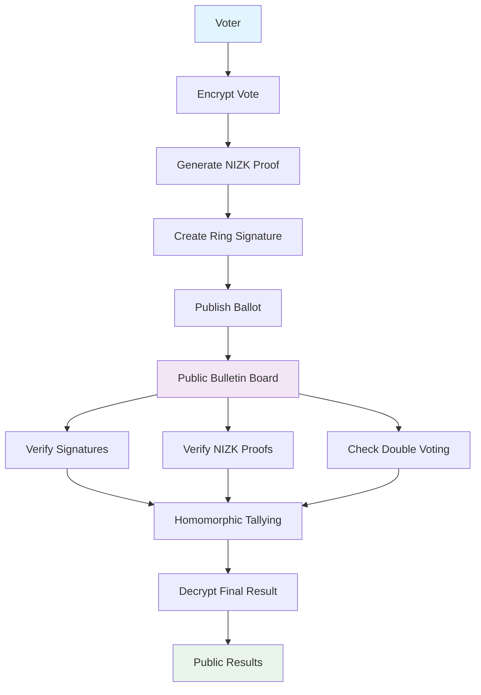

# 🗳️ ZKTally: Privacy-Preserving E-Voting Protocol

<div align="center">


*A secure electronic voting protocol combining linkable ring signatures, Paillier homomorphic encryption, and zero-knowledge proofs*

</div>

---

## 📋 Table of Contents

- [Overview](#-overview)
- [Key Features](#-key-features)
- [Cryptographic Components](#-cryptographic-components)
- [System Architecture](#-system-architecture)
- [Requirements](#-requirements)
- [Installation](#-installation)
- [Usage](#-usage)
- [Code Structure](#-code-structure)
- [Security Properties](#-security-properties)
- [Academic Paper](#-academic-paper)
- [Contributing](#-contributing)
- [License](#-license)

---

## 🎯 Overview

ZKTally is a **privacy-preserving electronic voting protocol** that addresses the fundamental challenges in secure digital democracy:

- **🔒 Voter Privacy**: Votes are encrypted and never revealed individually
- **🎭 Anonymity**: Ring signatures hide voter identity among all eligible voters  
- **🚫 Double-Vote Prevention**: Linkable signatures detect and prevent duplicate voting
- **✅ Vote Integrity**: Zero-knowledge proofs ensure all votes are valid (0 or 1)
- **🔍 Public Verifiability**: Anyone can verify the election results without trusting authorities

The protocol combines three advanced cryptographic primitives to achieve these properties while maintaining practical efficiency for real-world elections.

---

## ✨ Key Features

### 🔐 **End-to-End Encryption**
- Uses **Paillier Homomorphic Encryption** to keep votes secret
- Enables tallying without decrypting individual ballots
- Only the final aggregate result is ever decrypted

### 🎭 **Anonymous Authentication** 
- **Linkable Ring Signatures** provide voter anonymity
- Voters sign on behalf of the entire electorate
- Identity remains hidden while proving eligibility

### 🛡️ **Vote Integrity**
- **Non-Interactive Zero-Knowledge (NIZK) Proofs** ensure vote validity
- Cryptographically proves each vote is either 0 or 1
- Prevents malformed or invalid ballots

### 📊 **Public Verifiability**
- All signatures and proofs can be verified by anyone
- Homomorphic tallying allows independent result verification
- Complete transparency without compromising privacy

---

## 🔬 Cryptographic Components

### 1. **Paillier Homomorphic Encryption (PHE)**
```python
# Encrypt vote (0 or 1)
encrypted_vote, randomness = encrypt(vote_choice, public_key)

# Homomorphic addition of encrypted votes
total_encrypted = product_of_all_encrypted_votes
total_votes = decrypt(total_encrypted, public_key, private_key)
```

**Properties:**
- **Semantic Security**: Ciphertexts reveal no information about plaintexts
- **Additive Homomorphism**: `E(a) × E(b) = E(a + b)`
- **Probabilistic**: Same message encrypts to different ciphertexts

### 2. **Linkable Ring Signatures (LRS)**
```python
# Anonymous signature on behalf of all voters
ring_signature = sign(message, voter_index, all_public_keys, voter_private_key)

# Verification (doesn't reveal which voter signed)
is_valid = verify(message, ring_signature)

# Double-voting detection
is_same_signer = link(signature1, signature2)  # True if same voter
```

**Properties:**
- **Anonymity**: Signer's identity hidden among ring members
- **Linkability**: Same signer produces linkable signatures
- **Unforgeability**: Only ring members can produce valid signatures

### 3. **Zero-Knowledge Proofs (NIZK)**
```python
# Prove encrypted vote is binary (0 or 1) without revealing which
nizk_proof = prove_01(encrypted_vote, randomness, actual_vote, public_key)

# Anyone can verify the proof
is_valid_vote = verify_01(encrypted_vote, nizk_proof, public_key)
```

**Properties:**
- **Completeness**: Valid proofs always verify
- **Soundness**: Invalid votes cannot produce valid proofs  
- **Zero-Knowledge**: Proofs reveal nothing beyond validity

---

## 🏗️ System Architecture



### **Voting Process:**

1. **📝 Vote Casting**:
   - Voter encrypts their choice (0 or 1) using Paillier encryption
   - Generates NIZK proof that encrypted vote is binary
   - Creates linkable ring signature to prove eligibility anonymously
   - Publishes `(encrypted_vote, nizk_proof, ring_signature)` to bulletin board

2. **✅ Verification**:
   - Election observers verify all ring signatures
   - Verify all NIZK proofs for vote validity
   - Check for double-voting using signature linking

3. **📊 Tallying**:
   - Multiply all valid encrypted votes (homomorphic addition)
   - Decrypt only the final aggregate result
   - Publish total count with proof of correct decryption

---

## 📋 Requirements

### **System Requirements**
- **Python**: 3.8 or higher
- **OS**: Linux, macOS, or Windows
- **Memory**: 512MB+ RAM (for cryptographic operations)

### **Python Dependencies**
```bash
base58==2.1.1          # Base58 encoding for elliptic curve points
ecdsa==0.19.1           # Elliptic curve digital signatures
pycryptodome==3.22.0    # Cryptographic primitives
six==1.17.0             # Python 2/3 compatibility
```

### **Mathematical Dependencies**
- Large prime generation (2048-bit RSA security)
- Elliptic curve operations (SECP256k1)
- Modular arithmetic and group theory

---

## 🚀 Installation

### **1. Clone Repository**
```bash
git clone https://github.com/ZKTally/ZKTally.git
cd ZKTally
```

### **2. Create Virtual Environment**
```bash
python -m venv venv
source venv/bin/activate  # On Windows: venv\Scripts\activate
```

### **3. Install Dependencies**
```bash
pip install -r requirements.txt
```

### **4. Verify Installation**
```bash
python PHE.py  # Test Paillier encryption
python LRS.py  # Test ring signatures
```

---

## 🎮 Usage

### **Run Complete Voting Simulation**
```bash
python Simulation.py
```

This runs a complete election simulation with:
- 7 voters casting random ballots
- Committee verification of all signatures and proofs
- Homomorphic tallying of results
- Double-voting prevention demonstration

### **Example Output**
```
======================================================================
SECURE E-VOTING SIMULATION
======================================================================
Features:
• Paillier Homomorphic Encryption (vote privacy)
• NIZK Proofs (ensures votes are 0 or 1)
• Linkable Ring Signatures (anonymity + no double voting)
======================================================================

[Committee] Presidential Election Committee initialized with 1024-bit Paillier keys
[Committee] 7 voters registered successfully

==================================================
VOTING PHASE
==================================================
Vote choices (hidden from committee): [1, 0, 1, 1, 0, 1, 0]

[Voter V01] Casting vote: 1
[Voter V01] Vote cast successfully
[Committee] Vote from voter V01 accepted

[Voter V02] Casting vote: 0
[Voter V02] Vote cast successfully
[Committee] Vote from voter V02 accepted

... (additional voters)

[Committee] Successfully processed 7/7 votes

==================================================
DOUBLE VOTING PREVENTION TEST
==================================================
Attempting double vote with voter V01...
[Committee] Double voting detected! Key image already used

==================================================
VOTE TALLYING
==================================================
[Committee] Tallying 7 votes...
[Committee] Total votes for candidate: 4
[Committee] Total votes against candidate: 3

[Verification] Expected yes votes: 4
[Verification] Computed yes votes: 4
[Verification] Tally correct: True
```

### **Individual Component Testing**

#### **Test Paillier Encryption**
```python
from PHE import keygen, encrypt, decrypt, prove_01, verify_01

# Generate keys
public_key, private_key = keygen(bits=2048)

# Encrypt vote
vote = 1
encrypted_vote, randomness = encrypt(vote, public_key)

# Prove vote is binary
proof = prove_01(encrypted_vote, randomness, vote, public_key)
is_valid = verify_01(encrypted_vote, proof, public_key)

print(f"Vote encrypted: {vote}")
print(f"Proof valid: {is_valid}")
```

#### **Test Ring Signatures**
```python
from LRS import sign, verify
from ecdsa import SigningKey, SECP256k1

# Create voter keys
voters = [SigningKey.generate(curve=SECP256k1) for _ in range(5)]
pub_keys = [sk.verifying_key for sk in voters]

# Voter 0 signs a message
message = b"My encrypted vote and proof"
signature = sign(message, 0, pub_keys, voters[0])

# Verify signature (doesn't reveal which voter signed)
is_valid = verify(message, signature)
print(f"Ring signature valid: {is_valid}")
```

---

## 📁 Code Structure

```
experiment/
├── 📄 README.md              # This file
├── 📄 requirements.txt       # Python dependencies
├── 🗳️ Simulation.py          # Complete voting simulation
├── 🔐 PHE.py                 # Paillier Homomorphic Encryption
└──🖋️ LRS.py                  # Linkable Ring Signatures
```

### **Core Modules:**

#### **`PHE.py` - Paillier Homomorphic Encryption**
- `keygen(bits)`: Generate public/private key pair
- `encrypt(message, public_key)`: Encrypt vote with randomness
- `decrypt(ciphertext, public_key, private_key)`: Decrypt result
- `prove_01(ciphertext, randomness, vote, public_key)`: Generate NIZK proof
- `verify_01(ciphertext, proof, public_key)`: Verify NIZK proof

#### **`LRS.py` - Linkable Ring Signatures**
- `sign(message, signer_index, public_keys, private_key)`: Create ring signature
- `verify(message, signature)`: Verify ring signature
- `key_image(private_key)`: Generate linking tag
- `hash_to_point(point)`: Map points for signature construction

#### **`Simulation.py` - Complete System**
- `VotingCommittee`: Manages election and verifies ballots
- `Voter`: Represents individual voters
- `run_voting_simulation()`: Execute complete election
- `test_invalid_vote()`: Demonstrate security against invalid votes

---

## 🔒 Security Properties

### **✅ Properties Achieved**

| Property | Implementation | Security Basis |
|----------|----------------|----------------|
| **Vote Privacy** | Paillier encryption | Decisional Composite Residuosity |
| **Voter Anonymity** | Ring signatures | Discrete Logarithm Problem |
| **Double-Vote Prevention** | Linkable signatures | Key image uniqueness |
| **Vote Integrity** | NIZK proofs | Fiat-Shamir heuristic |
| **Public Verifiability** | Open verification | Cryptographic proofs |
| **Receipt-Freeness** | No decryptable receipts | Homomorphic tallying |

### **🛡️ Attack Resistance**

- **❌ Vote Buying**: Voters cannot prove how they voted
- **❌ Coercion**: No way to demonstrate vote choice to coercer  
- **❌ Double Voting**: Linkable signatures detect repeat attempts
- **❌ Invalid Votes**: NIZK proofs reject malformed ballots
- **❌ Ballot Stuffing**: Ring signatures require valid voter keys
- **❌ Result Manipulation**: Homomorphic tallying prevents tampering

### **⚠️ Assumptions**

- **Trusted Setup**: Election committee generates Paillier keys honestly
- **Secure Channels**: Voters receive authentic public keys
- **Bulletin Board**: Public board is append-only and tamper-evident
- **Random Oracle**: Hash functions modeled as random oracles (Fiat-Shamir)

---

## 📚 Academic Paper

This implementation accompanies the academic paper:

**"Design of a Privacy-Preserving and Anonymously Verifiable E-Voting Protocol using Linkable Ring Signatures, Paillier Homomorphic Encryption, and NIZK-Proven Binary Vote Correctness Enforcement"**

- **Author**: Muhammad Faiz A
- **Institution**: Institut Teknologi Bandung
- **Course**: II4021 Kriptografi

The paper provides:
- 📐 Mathematical foundations and security proofs
- 📊 Comparative analysis with existing protocols
- 🔍 Detailed NIZK proof construction
- 📈 Performance evaluation and complexity analysis

---

## 🤝 Contributing

We welcome contributions! Please see our contributing guidelines:

### **Areas for Contribution**
- 🚀 **Performance Optimization**: Improve cryptographic efficiency
- 🔧 **Additional Features**: Multi-candidate elections, threshold decryption
- 🧪 **Testing**: More comprehensive test suites
- 📖 **Documentation**: Enhanced tutorials and examples
- 🛡️ **Security**: Formal verification and additional security analysis

### **Development Setup**
```bash
# Fork the repository
git clone https://github.com/ZKTally/ZKTally.git
cd ZKTally

# Create feature branch
git checkout -b feature/your-feature-name

# Make changes and test
python -m pytest tests/

# Submit pull request
```

---

## 📜 License

This project is licensed under the MIT License - see the [LICENSE](LICENSE) file for details.

---

## 🙏 Acknowledgments

- **Research Inspiration**: Tsang & Wei's linkable ring signatures
- **Cryptographic Foundation**: Paillier's homomorphic encryption
- **Zero-Knowledge Theory**: Fiat-Shamir transformation
- **Academic Guidance**: ITB Cryptography Course (II4021)

---

## 📞 Contact

**Muhammad Faiz A**
- 📧 Email: m@faiz.at
- 🎓 Student ID: 18222063
- 🏫 Institut Teknologi Bandung

---

<div align="center">

**🔐 Secure • 🎭 Anonymous • ✅ Verifiable**

*Building trust in digital democracy through advanced cryptography*

</div>
